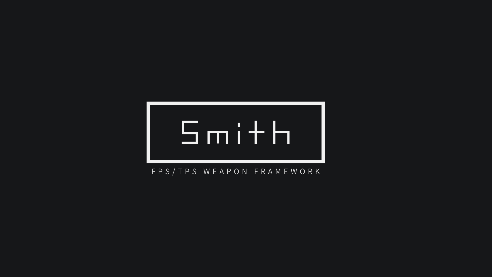

# Smith - Shooter weapon system framework for Unity
FPS/TPSの武器をノーコードで武器を作成できるフレームワーク




**Weapon System for Unity**はFPS/TPS向けのあらゆる武器をノーコードで作成可能なフレームワークです。 Riot
Gamesの[Valorant](https://playvalorant.com/en-us/arsenal/) に登場する武器を参考に作成されました。

* 一般的な武器であれば、インスペクターで完結。ノーコードで武器が作成できます。
* 各種インターフェース、基底クラスを実装するだけで動作を拡張することができます。
* EffectやBuiltin Audioに非依存。再生タイミングはUnityEventで表現。
* ProjectileとHitScanを選択可能。
* 弾丸の発射位置を変更可能。
* マガジンの種類を変更可能。
* 銃弾の保管方法を変更可能。

## 実装済みアクション

### Attack

- ShootingAction
  - 単発射撃です。Projectile、HitScanが選択できます。
- ShotgunShootingAction
  - 複数発動時射撃です。Projectile、HitScanが選択できます。 

### Aim

- AimAction
  - 武器の位置が変わるエイムです。
- ZoomOnlyAimAction
  - ズームのみのエイムです。TPSなどに使用できます。

### Control

- AimSwitchingAction
  - Valorantの武器のようにAimによってアクションを切り替えます。
- EventInvokeAction
- SelectableAction
  - セミオート、フルオートの切り替えなどに使用します。

## Interactable

- GrabAction

## Template

- IntervalActionBase

## 実装済みリコイル

- PatternRecoil
  - n発目はランダムにといった指定が可能
- SinRecoil
  - Sin波状にリコイルします。RustのAKのようなイメージ。
- NoneRecoil

# Requirement

Weapon System では、以下の環境が必須になります。

- Unity 2020 LTS Later
- [mackysoft.Unity-SerializeReferenceExtensions](https://github.com/mackysoft/Unity-SerializeReferenceExtensions)

# Install

## git urlを使う

git urlを利用してインストールすることができます。 インストールする場合は、 パッケージマネージャの`Add package from git URL...`に以下のurlを入力してください。

#### URL
```text
https://github.com/NebusokuDev/Smith.git?path=Assets/NebusokuDev/ShooterWeaponSystem
```
[使い方はこちらを参考にしてください](https://docs.unity3d.com/2019.4/Documentation/Manual/upm-ui-giturl.html)

## OpenUPMを使う

OpenUPMを利用してインストールすることができます。 OpenUPMレジストリを`Project Settings/Scoped Registry`に登録し、以下のパッケージを登録します。

```
com.nebusoku-dev.smith
```

もしくは、以下のコマンドラインをプロジェクトディレクトリ配下で入力します。

```
openupm add com.nebusoku-dev.smith
```

# Usage

## ObjectPoolBinderの設定

WeaponSystemのObjectPoolは`Locator<T>`からファクトリメソッドを利用し、依存性を解決しています。 そのため、このフレームワークを利用するシーンでは、`ObjectPoolBinder`
をシーンに付与する必要があります。

1. 空のGameObjectを作成し、名前を`ObjectPoolBinder`とします。
2. `ObjectPoolBinder`を作成したGameObjectにアタッチします。
> **Info**
> - 独自のObjectPoolを利用したい場合は`IObjectPoolFactory`を実装してください。

## プレイヤーの設定
### ルートのTransformを作成
1. 空のゲームオブジェクトを作成し、名前を`Player`とします。
2. `Player`に`Mover` もしくはをアタッチします。
3. `Player`の子に空のゲームオブジェクトを作成し、名前を`Camera Pivot`とします。このゲームオブジェクトがカメラの回転の基準になります。
4. `Camera Pivot`に`CameraRotor`、`CameraInput`、`LegacyMouseCameraInput`、をアタッチします。
5. `Camera Pivot`の子にMain Cameraを設置します。この際、Transform.positionをすべて0にするとFPSに、右寄りに設定するとTPSになります。
6. 設置したMainCameraに銃弾の発射方向とズームを司る`ReferenceCamera`をアタッチします。


### Moverのセッティング

Smithでは、テスト用のFPS/TPS向けのMoverが用意されています。
`IPlayerState`が実装されており、IPlayerStateをアタッチせずに使用できます。プロトタイピングの場合は利用することをおすすめします。

> **Info** 
> - 独自のStateを実装したい場合は`IPlayerState`を実装してください。

### 当たり判定の設定

1. プレイヤーのルートに`HitPoint`, `ObjectGroup`をアタッチします。
2. Characterのリグのボーンにコライダーと`HitBox`をアタッチし、`HitBox`の`BodyType`を指定します。


> **Info**
> - 独自のHitPointを利用したい場合は`IHasHitPoint`を実装してください。

## 武器の設定

1. 空のGameObjectを作成し、任意の名前にします
2. 作成したGameObjectに`ObjectPermission`, `Weapon`, `LegacyWeaponInput`をアタッチします。
3. それぞれのアクションに対し、各種設定をしていきます。

>  **! Note !**
> - `[Serialize Reference]`アトリビュートを使用しているため拡張したクラスには、`[System.Serializable]`アトリビュートを必ず追加してください。
> - インスペクターのGUIを展開するとフレームレートとが急激に下がります。実行する際には、インスペクターのGUIを閉じてから実行してください。

# Contribute
このリポジトリではReadme、wikiの更新と翻訳、バグ報告と修正、新機能の追加を受け付けています。PR、Issueよろしくおねがいします。

- 不明な点があればIssueまたは[TwitterのDM](https://twitter.com/neubsoku_dev)までお願いします。
# Author Info
- NebusokuDev
- [Twitter](https://twitter.com/neubsoku_dev)


# License
"Smith" is under [MIT license](https://en.wikipedia.org/wiki/MIT_License).